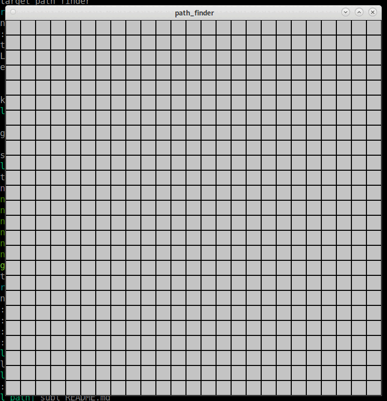

# path_finder
**:star2: A-star Path-finding application :star2:**

[[_TOC_]]



# Controls

Not much to know :
- **Right-click** to add non-walkable cells.
- **Left-click** to add a starting/ending point.
- **Enter** to run the algorithm.

# Configuration options

*path_finder* is configured using a single JSON file.

An example is provided in **conf/default.json**

```
{
    "bindings": {
        "clear": "Space",
        "analyze": "Enter",
        "exit": "Escape",
        "reload": "F5"
    },
    "graphics": {
        "width": 750,
        "height": 750,
        "frame-rate": 60
    },
    "grid": {
        "rows": 25,
        "cols": 25
    },
    "analyzer": {
        "heuristic": "manhattan",
        "allow-diagonals": false  
    }
} 
```

## Bindings

Bind actions to specific keys.

| name | description | default value
| ------ | ------ | ------ |
|  **clear** | Clear the grid (remove drawn cells) | **Space** |
|  **analyze** | Perform an analyze (run A-star algorithm) | **Enter** |
|  **exit** | Exit the program | **Escape** |
|  **reload** | Reload the programm (apply configuration file changes) | **F5** |

## Graphics

Specify display window settings.

| name | description | default value
| ------ | ------ | ------ |
|  **width** | Window width in pixels | **750** |
|  **height** | Window height in pixels | **750** |
|  **framerate** | Do not allow more than x frames/s. | **60** |

## Grid 

Specify grid settings.

| name | description | default value
| ------ | ------ | ------ |
|  **rows** | Number of rows | **25** |
|  **cols** | Window columns | **25** |

## Analyzer

Specify algorithm settings.

- **heuristic**
  - "manhattan"
  - "euclidean"
  - "octogonal"

- **allow-diagonals** : Allow to move diagonally.

# Compile and install

## Dependencies

*path_finder* has a build-time dependency on [**SFML**](https://www.sfml-dev.org/index-fr.php).

Please refer to its [Documentation](https://www.sfml-dev.org/download/sfml/2.5.1/index-fr.php) for more informations.

*path_finder* also has a build-time dependency on [**miniJSON**](../minijson) on the form of a submodule. The submodule is automatically updated within the CMake of the project.

## Build steps

Baically, here are the steps you might wanna do (debian example) to compile the project :

1. Clone the project 

```
cd ~/git
git clone https://github.com/MericLuc/sfml_path_finder.git
```

2. Create a build folder

```
mkdir ~/build && cd ~/build
```

3. Build the project

```
cmake -S ~/git/path_finder .
make
```

4. Run 

```
~/build/path_finder -i ~/git/path_finder/conf/default.json
```

## Install

*path_finder* provide an **install** target.

```
cmake -S ~/git/path_finder -DCMAKE_PREFIX_INSTALL="/your/install/folder"
make install
```

It will install the following files :

```
${CMAKE_INSTALL_PREFIX}/path_finder
        path_finder
        default.json
```